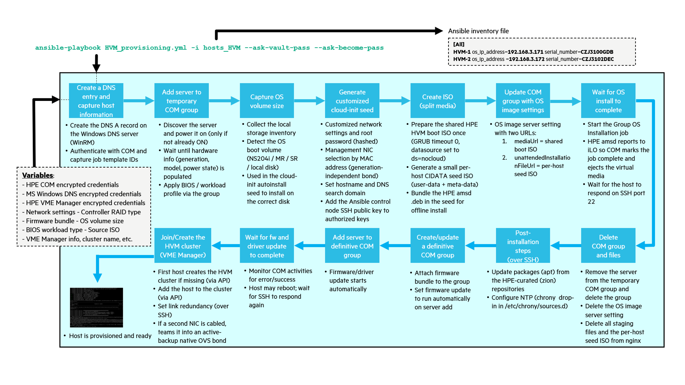
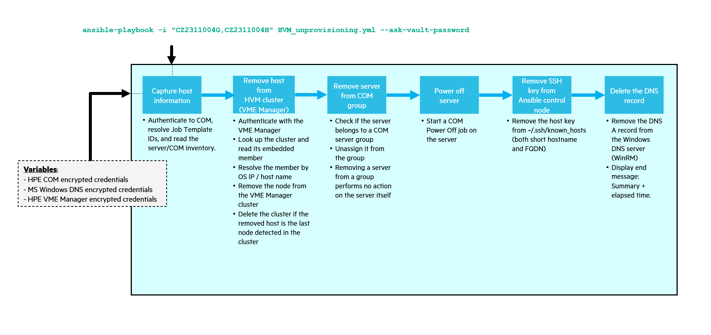
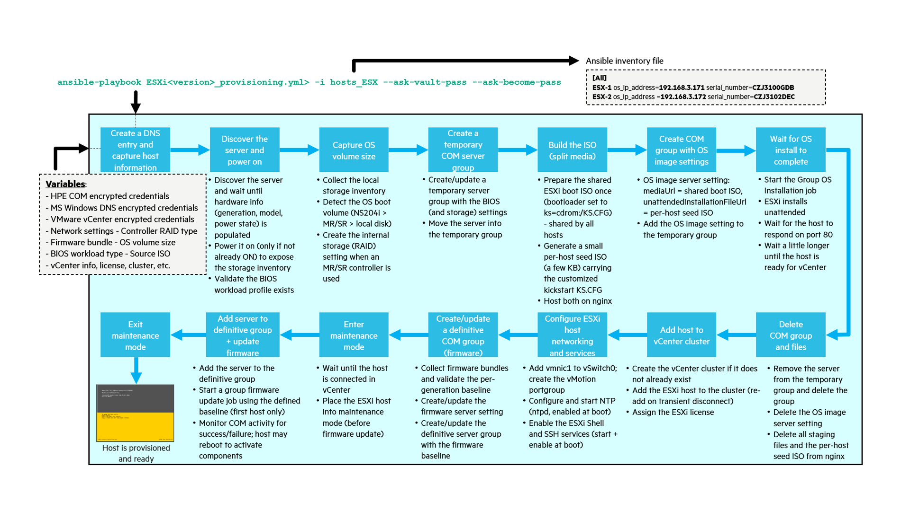
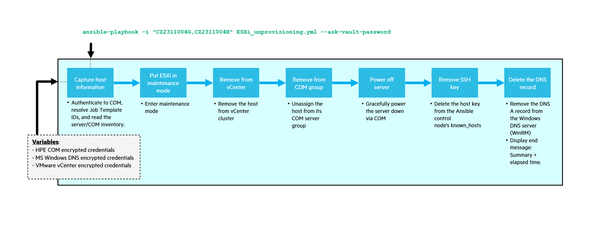
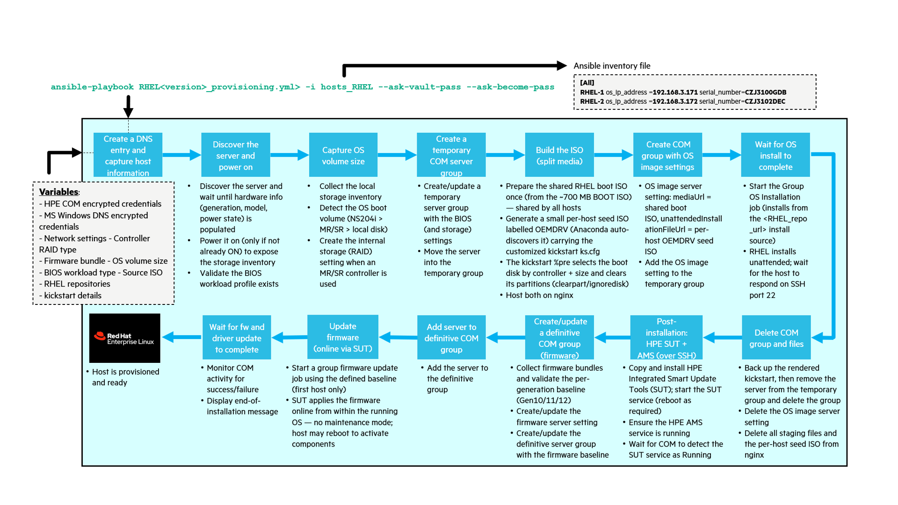
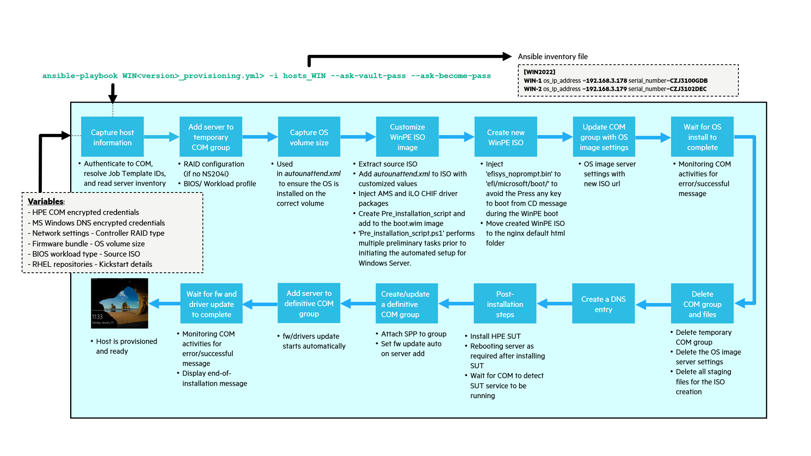
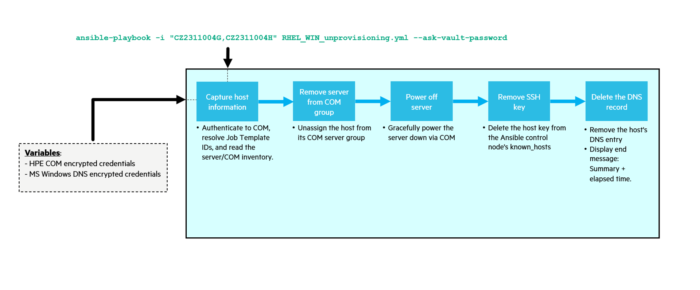

# Automatic bare metal provisioning with HPE Compute Ops Management and Ansible

Automatic bare metal provisioning refers to the process of automatically deploying and configuring physical servers or bare metal machines using automated tools such as Ansible in this project.

The goal is to enable quick and easy provisioning of servers managed by HPE Compute Ops Management and enable the long list of benefits of automatic bare metal provisioning.

In this project, automating the provisioning of operating systems on bare metal servers is made simple and accessible to anyone with basic knowledge of Ansible, HPE Compute Ops Management, and kickstart techniques. While it is generally a complex process that requires a wide range of skills, this project simplifies it with the use of auto-customized kickstarts, auto-generated ISO files and by exploiting the very interesting functions of HPE Compute Ops Management server groups.

One of the benefits of Ansible is parallel execution that allows the simultaneous execution of tasks on multiple hosts. In other words, with one playbook execution, you can provision a customized OS on multiple servers (5 by default). This can significantly speed up the execution time of playbooks, especially when managing large environments with a large number of hosts. Parallel execution enables faster infrastructure provisioning, configuration management, and application deployment across multiple hosts, improving overall efficiency and reducing the time required for administrative tasks.


## Contents

- [Main benefits](#main-benefits)
- [Design philosophy and customization](#design-philosophy-and-customization)
- [Demo videos](#demo-videos)
- [Supported operating systems](#supported-operating-systems)
- [Supported storage configuration](#supported-storage-configuration)
- [Network configuration](#network-configuration)
- [Documentation](#documentation)
- [Process flow](#process-flow)
- [Prerequisites](#prerequisites)
- [Ansible control node information](#ansible-control-node-information)
- [Windows DNS Server configuration](#windows-dns-server-configuration)
- [Preparation to run the playbooks](#preparation-to-run-the-playbooks)
- [How to run a playbook](#how-to-run-a-playbook)
- [HPE Morpheus VM Essentials (HVM) provisioning](#hpe-morpheus-vm-essentials-hvm-provisioning)
- [Output samples](#output-samples)
- [Built and tested with](#built-and-tested-with)
- [License](#license)


## Main benefits

Here are some benefits of automatic bare metal provisioning:

- **Time-saving & efficiency**: Eliminates manual, repetitive setup, cutting turnaround time so teams can focus on higher-value work.
- **Consistency & standardization**: Server configurations are standardized across the infrastructure, reducing human error and simplifying troubleshooting and maintenance.
- **Scalability**: Easily scale the infrastructure up or down by automating the deployment (and decommissioning) of servers on demand.
- **Reduced costs**: Less manual labor and fewer errors lower the operational cost of provisioning over time.
- **DevOps integration**: Fits infrastructure-as-code and configuration-management practices, so environments can be version-controlled and replicated.

[↑ Back to Top](#automatic-bare-metal-provisioning-with-hpe-compute-ops-management-and-ansible)

## Design philosophy and customization

This project is intentionally designed to maximize compatibility across a wide range of customer environments. Rather than hard-coding a single opinionated deployment, it ships with flexible, sensible defaults for the areas that vary most from one site to another — most notably **network bonding/teaming**, **storage drive and controller selection**, and **cluster creation or node join** (a vCenter cluster for ESXi, an HPE VME Manager cluster for HVM).

These defaults provide a baseline that works out of the box in most scenarios while keeping the solution highly adaptable. Every one of these behaviors is driven by variables (see the per-OS `vars/` files and inventories) and can be easily customized or extended to align with a specific customer's requirements, standards, and operational preferences — for example, changing the bond mode, adjusting the storage-controller selection order, tuning the OS boot-volume RAID type/size, or switching between creating a new cluster and joining an existing one. The goal is a solution that is safe to run as-is, yet straightforward to tailor.

The most commonly adjusted settings are summarized below; each is described in detail in the [Network configuration](#network-configuration) and [Supported storage configuration](#supported-storage-configuration) sections.

| Area | Key variables | Where to set them |
|------|---------------|-------------------|
| NIC bonding / teaming | `enable_nic_bonding` (all OSes); RHEL also `bond_member_selection`, `bond_member_count`, `bond_member_adapter_match`, `mgmt_bond_mode` | `vars/HVM_vars.yml`, `vars/ESXi8.0.u2_vars.yml`, `vars/RHEL9.3_vars.yml`, `group_vars/WIN2022/Windows_vars.yml` |
| Storage controller selection & OS boot volume | Selection order NS204i › MR/SR › local disk (logic); `raid_type`, `volume_size_in_GB` for MR/SR volumes | per-OS `vars/*_vars.yml` |
| Cluster create or join | ESXi (vCenter): `vcenter_hostname`, `cluster_name`, `datacenter_name`. HVM (VME Manager): `cluster_name`, `join_hvm_cluster`, the VME group/cloud/layout ids, `mgmt_vlan`, `hvm_mgmt_bond_mode` | `vars/ESXi8.0.u2_vars.yml`, `vars/HVM_vars.yml` |
| Parallelism (servers per run) | `ansible_forks` (5 by default) | set in each provisioning playbook |

[↑ Back to Top](#automatic-bare-metal-provisioning-with-hpe-compute-ops-management-and-ansible)

## Demo videos

For a concise understanding of the possibilities offered by this bare metal provisioning project with HPE Compute Ops Management and Ansible, you can watch the following videos:

**Efficient Bare Metal Provisioning for Windows Server with HPE Compute Ops Management and Ansible**:  

[](https://www.youtube.com/watch?v=A6RD6nIAFmw)


**Efficient Bare Metal Provisioning for RHEL 9.3 with HPE Compute Ops Management and Ansible**: 

[](https://www.youtube.com/watch?v=6_o8yB4cvag)


**Efficient Bare Metal Provisioning for ESXi with HPE Compute Ops Management and Ansible**: 

[](https://www.youtube.com/watch?v=_ySgROdd_Bw)

> **Note**: A dedicated demo video for **HPE Morpheus VM Essentials (HVM)** provisioning is not available yet — I haven't had time to record one. The videos above (Windows, RHEL and ESXi) illustrate the same end-to-end workflow, which applies to HVM as well. A video will be added when time permits.

[↑ Back to Top](#automatic-bare-metal-provisioning-with-hpe-compute-ops-management-and-ansible)

## Supported operating systems

For automating the provisioning of operating systems, four main playbooks are available, one for each type of operating system:
- HPE Morpheus VM Essentials - HVM OS (Ubuntu 24.04 based hypervisor)
- VMware ESXi 8
- Red Hat Enterprise Linux and equivalent 
- Windows Server 2022 and equivalent

> **Note**: HVM (HPE Virtual Machine) is the hypervisor that is part of the HPE Morpheus VM Essentials solution. Unlike ESXi (which uses a kickstart), the HVM OS is Ubuntu 24.04 based and is provisioned using an unattended Ubuntu **autoinstall** (cloud-init) seed (the split-media model — see [Process flow](#process-flow)). Once installed, the host is updated, time-synchronized (NTP) and added to an HVM cluster managed by the HPE VM Essentials Manager. See [HPE Morpheus VM Essentials (HVM) provisioning](#hpe-morpheus-vm-essentials-hvm-provisioning) for the full workflow.

> **Note**: UEFI secure boot is not supported but can be enabled at a later date once the operating system has been installed.

> **Note**: iLO Security in FIPS or CAC mode is not supported.

[↑ Back to Top](#automatic-bare-metal-provisioning-with-hpe-compute-ops-management-and-ansible)

## Supported storage configuration

> These settings are part of the project's flexible defaults — see [Design philosophy and customization](#design-philosophy-and-customization) for the customization overview.

The operating system boot volume is only supported when configured with internal local storage using either an HPE NS204i-x NVMe Boot Controller or HPE MegaRAID (MR) or SmartRaid (SR) Storage Controller.

 > **Note**: Internal storage policies are used to create the RAID configuration for the OS volume. This requires storage controllers with firmware that support DMTF Redfish storage APIs. Refer to the [storage controller firmware requirements](https://internal.support.hpe.com/hpesc/docDisplay?docId=a00115739en_us&docLocale=en_US&page=GUID-91880D5C-C0CD-421F-B5E7-C474CD9BA017.html) (access requires authentication with your HPE GreenLake account)

Booting from a SAN (Storage Area Network) is currently not supported by this project.

### Storage Controller selection 

To avoid data loss or other issues, the playbooks include some logic to ensure that the target disk for OS installation is correctly identified. To do this, the size of the volume detected by Compute Ops Management and presented by the internal local storage (NS204i or MR or SR controller) is used to make this selection. In addition, when multiple controllers are detected, disk selection is determined by the following conditions:

1. If an HPE NS204i-x NVMe Boot Controller is detected, the automatic RAID1 volume associated with it will be used for installing the OS.
2. If there is no HPE NS204i-x NVMe Boot Controller found, the first available HPE MegaRAID (MR) or SmartRaid (SR) Storage Controller with at least 2 disks will be utilized for the OS installation.
3. If neither an HPE NS204i-x NVMe Boot Controller nor an MR/SR controller is detected, the playbooks will check for the presence of a local disk. If a local disk is available, it will be selected as the target volume for the OS installation.


### OS boot volume RAID type and size

- When an HPE NS204i-x NVMe Boot Controller is present, it automatically creates a RAID1 (mirror) between the two NVMe drives and allocates the entire disk for the operating system volume. In this scenario, the playbooks in this project skip the OS boot volume creation step, as the NS204i controller manages it automatically. The same approach applies when only a local disk is used.

- With MR/SR Storage controller, the creation of the operating system boot volume is managed by the playbooks of this project and in this case, you can define the volume settings in the OS variable file located in /vars using:
  - `raid_type`: Defines the RAID level (RAID0, RAID1 or RAID5) 
  - `volume_size_in_GB`: Defines the OS volume size. It must be a number greater than 0 or equal to -1 to indicate that the entire disk should be used.

> **Recommendation**: During the OS installation process, avoid presenting SAN volumes (such as VMFS datastores or cluster volumes) to the servers until the installation is complete. Even though the installer targets the internal logical drive, withholding SAN volumes during installation helps prevent accidental selection or modification, reducing the risk of data loss or corruption on existing SAN storage.

> **Note**: For HVM, the OS boot volume is installed on a single disk configured as an **LVM group** using the entire disk (`sizing-policy: all`). Disk selection follows the same storage controller logic as ESXi (NS204i > MR/SR > local disk); keep SAN volumes unpresented during installation so the intended local boot volume is selected. As for ESXi and RHEL, the autoinstall seed clears the target disk's existing partitions before installing (the Ubuntu **autoinstall `early-commands`** are the Subiquity equivalent of the RHEL kickstart `%pre` `clearpart` / `ignoredisk --only-use` logic): they identify the boot disk by controller type and the COM-detected size, wipe its partition table, and pin the OS install to it (by model for an NS204i controller, by size otherwise) so a larger SAN or local data disk is never selected. In addition, when `hvm_clear_foreign_partitions` is `true` (default), any **other** disk carrying a *foreign/unreadable* partition table (e.g. a leftover VMFS or foreign-RAID signature from a previous deployment) is cleared as well — this is required because such a disk otherwise makes the Ubuntu Subiquity installer abort with `Disk(ptable='unsupported' …)` / `KeyError: 'unsupported'`. Disks with a valid GPT/DOS partition table (real data disks) are left untouched.

[↑ Back to Top](#automatic-bare-metal-provisioning-with-hpe-compute-ops-management-and-ansible)

## Network configuration

> These settings are part of the project's flexible defaults — see [Design philosophy and customization](#design-philosophy-and-customization) for the customization overview.

- For ESXi, the network configuration during the OS installation starts by using the first available nic (vmnic0). Once the OS is installed, and when `enable_nic_bonding` is `true`, a second uplink (vmnic1) is added to the standard vSwitch0 for management-link redundancy — but **only if vmnic1 is physically connected** (its link state is queried first), so an uncabled port never creates false redundancy. vSwitch0 uses its default active/active failover (route based on originating port ID), which requires **no switch-side LAG**. Set `enable_nic_bonding` to `false` (in `vars/ESXi8.0.u2_vars.yml`) to keep vSwitch0 on vmnic0 only.

- For HVM, the network configuration follows the HPE VM Essentials requirements. The HPE `hpe-vm` installer builds the management and compute networks as **Open vSwitch (OVS) bridges**, so the install seed assigns the management IP to a **single plain management NIC** (renamed `mgmt0`, on a tagged VLAN when `mgmt_vlan > 0`) rather than a pre-built Linux bond. When a **second NIC is cabled**, a post-join play teams it into an active-backup native OVS bond for management-link (and, by default, VM-traffic) redundancy — a single-NIC host is a no-op. The management bond builder is **self-healing**: it checks gateway reachability before and after teaming, and if building the bond makes the gateway unreachable (e.g. active-backup selects a slave on a wrong/dead switch port on a fabric without a LAG) it automatically reverts that bond to the single primary uplink, so the host is never left unreachable. No switch-side LAG is required. A separate dedicated compute network is also supported (opt-in). See [HVM networking](files/HVM_networking.md) for the full detail (second-NIC teaming, converged vs separate compute, NIC-count requirements).

- For RHEL, the OS is **installed over a single management NIC** and NIC bonding (if requested) is created **after** the install, on the running system — the same model used by HVM, ESXi and Windows. The install NIC and the bond members are selected **by MAC from the COM inventory** (`bond_member_selection: auto`), which is generation-independent (interface names differ across ProLiant generations). When `enable_nic_bonding` is `true` and a **second management NIC is cabled**, a post-install play (over SSH) builds an active-backup `team0` bond carrying the static IP; a single-cabled-NIC host stays on one NIC. The bond builder is **self-healing**: if the freshly-built bond cannot reach the gateway (e.g. the second port lands on a wrong/dead switch port on a fabric without a LAG) it automatically reverts to the single primary NIC, so the host is never left unreachable. No switch-side LAG is required. These variables live in `vars/<Linux_OS>_vars.yml` (`enable_nic_bonding`, `bond_member_selection`, `bond_member_count`, `bond_member_adapter_match`, `mgmt_bond_mode`).

  > **Cabling note (HVM & RHEL, `auto` mode)**: the **primary** management port — `mgmt0` for HVM, the install NIC for RHEL — is the **first** Ethernet port of the matched adapter **in COM-inventory (MAC) order**, and this primary selection is **not** carrier-aware. That first inventory port must therefore be **cabled** to the management network. On a multi-port adapter (e.g. an Intel I350 quad-port) where only a *later* port is patched, the management IP can land on an un-cabled port: the OS installs but the host never answers on its IP (a post-install *"Timeout when waiting for `<ip>`:22"*, which now fails with explicit cabling guidance). If your cabled port is not the first inventory port, either cable the first port (cabling **both** is ideal — the primary gets the IP and the self-healing team uses the second as backup), or pin the cabled port with `bond_member_selection: mac` + `bond_member_macs` (first MAC = cabled port). The post-install **second-NIC** teaming *is* carrier-aware (it only teams a cabled secondary); this caveat is only about the **primary** install/`mgmt0` port.

- For Windows Server, a `Post_installation_script.ps1` script located in `c:\Windows\Setup\Scripts` is executed when the OS installation is complete. This PowerShell script among other things, sets IP parameters and NIC teaming. The configuration for NIC teaming is controlled by the `enable_nic_bonding` variable, which can be found in `group_vars/<WINxxxx>/Windows_vars.yml`. When teaming is enabled, a `SwitchIndependent` LBFO team is created from the first two connected NICs (or a single-member team when only one NIC is connected) using the `HyperVPort` load-balancing algorithm, which behaves effectively active-backup for the single management IP and requires **no switch-side LAG**.

With Linux and Windows:
  - When `enable_nic_bonding` is set to `true`, NIC teaming will be established using the first two connected NICs. However, if only one NIC is connected, the network settings will be configured on that single NIC (no bond is created for a single-NIC host). For RHEL the OS install always runs over a single NIC and the bond is built afterwards (see above); for Windows the teaming is configured by the post-installation script.

  - When `enable_nic_bonding` is set to `false`, no NIC teaming will be created. In this case, the network settings will be configured on the first connected NIC that is detected.

### Optional corporate proxy

Hosts behind a corporate proxy can reach external resources during and after installation by setting the optional `proxy_url` variable (full URL form, e.g. `http://proxy.example.com:8080`) in the per-OS variable file (`vars/<OS>_vars.yml`, or `group_vars/WIN2022/Windows_vars.yml` for Windows). It is empty by default (direct connection). Per OS:

- **RHEL**: routes the `%post` external package access (e.g. the EPEL release rpm from `dl.fedoraproject.org`) through the proxy and persists it for `dnf`/`yum` on the installed system; the internal RHEL repo and the local domain bypass it.
- **ESXi**: writes a persistent proxy for shell/CLI-driven downloads (e.g. `esxcli software ... --proxy`).
- **Windows**: sets a persistent system WinHTTP proxy plus the machine WinINET setting.
- **HVM**: the HVM install itself is offline (from the ISO), so the proxy is applied to the autoinstall `proxy:` directive for **post-install** network access — the first-boot access to the HPE VME `zion` repos (`update1.linux.hpe.com`), the `apt upgrade`, and the VME cluster join — and is also written to the installed system's apt config.


[↑ Back to Top](#automatic-bare-metal-provisioning-with-hpe-compute-ops-management-and-ansible)

## Documentation

This repository hosts an extensively detailed lab guide that provides comprehensive instructions on the entire setup process for this project. The guide encompasses several critical aspects:

- Step-by-Step Installation Instructions: A meticulous walkthrough to install all necessary components from the ground up.
- Configuration Details: Clear guidelines on how to accurately configure each variable within the project environment.
- Execution Protocol: Straightforward steps detailing how to execute a playbook effectively, allowing you to provision operating systems with ease.


See [HPE GreenLake for Compute Ops Management baremetal provisioning with Ansible](https://github.com/jullienl/HPE-COM-baremetal/blob/main/HPE%20GreenLake%20for%20Compute%20Ops%20Management%20baremetal%20provisioning%20with%20Ansible.pdf) 

[↑ Back to Top](#automatic-bare-metal-provisioning-with-hpe-compute-ops-management-and-ansible)

## Process flow

Each operating system has two single-run, end-to-end playbooks — one to **provision** a bare-metal server and one to **unprovision** (cleanly decommission) it. Every provisioning run takes a server from bare metal to a fully configured, cluster-ready host in one execution: BIOS/storage configuration, OS installation, networking, firmware/driver update, and (where applicable) cluster join. Every unprovisioning run reverses that: it removes the host from its cluster (if any), unassigns it from its COM group, powers it off, and cleans up its SSH and DNS entries.

> **Image model at a glance**: RHEL, ESXi and HVM use the **split-media** model — one large boot ISO is prepared **once** and shared by every host (COM `mediaUrl`), while a tiny per-host **seed** ISO (a few KB) carries the customized answer file (RHEL → `OEMDRV` kickstart, ESXi → `KS.CFG`, HVM → `CIDATA` cloud-init) attached via COM `unattendedInstallationFileUrl`. Windows is the exception: it builds a **per-host WinPE image** (no shared boot + seed split).

### HVM (HPE Morpheus VM Essentials)

- **Provisioning** — From bare metal to a VME-managed cluster node in one run: install the HVM OS, configure networking, and create or join the VME/HVM cluster automatically.   
  `Shared prepared boot ISO (built once) + per-host CIDATA cloud-init seed ISO → COM server-group config → firmware → join VME/HVM cluster`

    


- **Unprovisioning** — Remove the host from the VME/HVM cluster, unassign it from its COM group, power it off, and clean up SSH/DNS.   
  `Remove from VME/HVM cluster → unassign from COM group → power off → clean up SSH/DNS`

    

### VMware ESXi

- **Provisioning** — From bare metal to a cluster-ready host in one run: install ESXi, configure networking, and create or join the vCenter cluster automatically.   
  `Shared prepared boot ISO (built once) + per-host KS.CFG seed ISO → COM server-group config → firmware (maintenance mode)`

    

- **Unprovisioning** — Remove the host from the vCenter cluster, unassign it from its COM group, power it off, and clean up SSH/DNS.   
  `Remove from vCenter cluster → unassign from COM group → power off → clean up SSH/DNS`

    

### Red Hat Enterprise Linux (and equivalents)

- **Provisioning** — From bare metal to a fully configured host in one run: install RHEL, configure networking and storage, and update firmware/drivers.   
  `Shared prepared boot ISO (built once) + per-host OEMDRV kickstart seed ISO → COM server-group config → firmware`

    

### Windows Server (2022 and equivalents)

- **Provisioning** — From bare metal to a domain-joined host in one run: install Windows, run post-install networking, install HPE SUT, and update firmware/drivers.   
  `Per-host WinPE image → COM server-group config → SUT + AD domain join → firmware`

    


### RHEL & Windows Server unprovisioning

RHEL and Windows share a single unprovisioning playbook (`RHEL_WIN_unprovisioning.yml`): unassign the server from its COM group, power it off, and clean up SSH/DNS.   
`Unassign from COM group → power off → clean up SSH/DNS`

   


[↑ Back to Top](#automatic-bare-metal-provisioning-with-hpe-compute-ops-management-and-ansible)

## Prerequisites

- An Ansible control node running Ansible:
  - Meets Ansible system requirements, see https://access.redhat.com/documentation/en-us/red_hat_ansible_automation_platform/2.3/html/red_hat_ansible_automation_platform_planning_guide/platform-system-requirements#ref-controller-system-requirements
  - With internet connectivity to interface with the HPE GreenLake platform and must also be connected to the management network where the servers will be deployed.
  - With a storage volume large enough to host a copy of the ISO files. Thanks to the **split-media** model (see [Process flow](#process-flow)), the large boot ISO is copied to `nginx` **only once** and shared by every host, so only a few KB per host is added on top — this removes the slow per-host multi-GB ISO copy.

    > **Note**: For ESXi and RHEL, the shared boot ISO is referenced by the COM `mediaUrl` (`prepared_iso_file`) and the per-host seed ISO is attached via the COM `unattendedInstallationFileUrl` field. ESXi locates its kickstart because the shared `boot.cfg` is set to `ks=cdrom:/KS.CFG` (the installer scans the attached CD-ROM devices); RHEL uses a seed ISO labelled `OEMDRV`, which Anaconda auto-discovers with no boot parameter. For RHEL, the host-agnostic HPE AMS rpm is baked into the shared ISO once.

    > **Note**: 1TB+ is recommended if you plan to provision several servers in parallel. 

  - At the right date and time to support the various time-dependent playbook operations. 

    > **Note**: Ensure that your Ansible machine's clock is accurately synchronized. This synchronization is essential for time-sensitive playbook operations, such as task monitoring operations, which use time-based activity filtering. This check must be performed before running any playbook associated with this project. If the time isn't right, these playbooks might not work as expected. It is highly recommended to use NTP (Network Time protocol) for synchronizing the Ansible Control node's time. 

- A web server containing ISO images of the various operating systems to be provisioned. For Windows provisioning, a custom WinPE image must be created and supplied. See below for more details.

- For HVM provisioning, the HPE-provided **HVM OS Install ISO** (`HVM_Install_******.iso`, Ubuntu 24.04 based) must be downloaded from [My HPE Software Center](https://myenterpriselicense.hpe.com/) (a valid HPE Morpheus VM Essentials license is required) and copied to the web server defined by the `src_iso_url` / `src_iso_file` variables in `vars/HVM_vars.yml`.

- For HVM provisioning, the HPE **Agentless Management Service** (`amsd`) Debian package must be present in `files/HVM_24.04/` (its filename is set by the `AMS_package` variable in `vars/HVM_vars.yml`). This agent is required for HPE Compute Ops Management to detect completion of the OS installation (iLO reports the OS as installed once `amsd` is running); without it the COM installation job times out and the iLO virtual media is not ejected. The playbook bundles this package into the per-host cloud-init seed and installs it on first boot with `dpkg -i`. This is fully offline: all of `amsd`'s dependencies already ship in the minimal HVM install image, so no access to the HPE Software Delivery Repository or the Ubuntu archive is needed at install time. Download the Ubuntu 24.04 (`noble`) `amsd` package from the HPE Management Component Pack (MCP): [https://downloads.linux.hpe.com/SDR/repo/mcp/pool/non-free/](https://downloads.linux.hpe.com/SDR/repo/mcp/pool/non-free/) (look for `amsd_*-ubuntu24_amd64.deb`, e.g. `amsd_4.2.0-2046.12-ubuntu24_amd64.deb`).

- For HVM provisioning, an **HPE VM Essentials Manager** (the Morpheus-based virtual appliance) must already be deployed and reachable, and the VME "Group" referenced by the `vme_group_name` variable must exist. The HVM cluster itself is created automatically by the playbook (on the first host) if it does not already exist, then each host is added to it. Deploying the VM Essentials Manager appliance is a one-time manual step performed with the interactive `sudo hpe-vm` console on one host, as described in the [HPE Morpheus VM Essentials Deployment Guide](https://support.hpe.com/hpesc/public/docDisplay?docId=sd00007332en_us&page=GUID-EF5CE241-8260-484D-95C1-6CDEAE24D932.html).

- For Linux provisioning, a network location (http/https) containing an installation source for each Linux version to be provisioned. 

  > **Note**: The installation source URL which points to the extracted contents of the DVD ISO image is defined by the variable `<OS>_repo_url` in `<OS>_vars.yml` in the `vars` folder. 

  > **Note**: To reduce the process of creating Red Hat (and community Enterprise Linux: CentOS, Alma Linux, Rocky Linux) customized ISO images, this project uses BOOT ISO images (~700MB) instead of traditional DVD ISOs (~8GB). The BOOT ISO does not contain any installable packages. It is therefore necessary to set up an installation source that stores a copy of the DVD ISO image contents, so that the BOOT ISO image installer can access the software packages and start the installation.

  > **Note**: To learn how to prepare an installation source using HTTP/HTTPS, see [Creating an installation source using HTTP or HTTPS](https://access.redhat.com/documentation/en-us/red_hat_enterprise_linux/8/html/performing_a_standard_rhel_8_installation/prepare-installation-source_installing-rhel#creating-an-installation-source-on-http_prepare-installation-source)

- For Windows provisioning, a network location containing the Windows Server ISO image must be provided as an UNC path (\\server\share).

  > **Note**: The network location which points to the DVD ISO image is defined by the variable `src_iso_network_share` in `Windows_vars.yml` in the `group_vars` folder. The `src_iso_file_path` defines the Windows Server ISO image location in the network share.
  
- HPE Compute Ops Management API Client Credentials with the Compute Ops Management Administrator role.

  > **Note**: To learn more about how to set up the API client credentials, see [Configuring API client credentials](https://support.hpe.com/hpesc/public/docDisplay?docId=a00120892en_us&page=GUID-23E6EE78-AAB7-472C-8D16-7169938BE628.html) 

  > **Note**: There is no need for any predefined server groups or server settings in HPE Compute Ops Management. Each playbook is written to handle the creation of temporary server groups and server settings for the server BIOS, storage, and operating system configuration.

- All HPE servers to be provisioned must be onboarded to the HPE GreenLake platform and their iLO must be correctly configured (with an IP address and connected to the cloud platform). 

  > **Note**: To utilize the servers in HPE Compute Ops Management, certain steps need to be followed. Each server should be onboarded to the HPE GreenLake platform, properly licensed, and assigned to the COM application instance. Additionally, it is important to ensure that the iLO of each server is connected to the HPE GreenLake platform. To learn more, see [Configuring Compute Ops Management direct management](https://support.hpe.com/hpesc/public/docDisplay?docId=sd00001293en_us&page=GUID-8F12FE6C-DC13-44DC-921B-041E8DC628DB.html)

- The Ansible inventory files for each operating system (i.e. [hosts_ESX](https://github.com/jullienl/HPE-COM-baremetal/blob/main/hosts_ESX)) must be updated. Each server should be listed in the corresponding inventory file along with its serial number and the IP address that should be assigned to the operating system.

- A Windows DNS server configured to be managed by Ansible. See below for more details.

  > **Note**: To ensure the smooth operation of this project, it is essential that a DNS record exists for each provisioned server. For this reason, each playbook includes a task to create a DNS record on the Windows DNS server defined in `vars` folder. 

  > **Note**: For this project, I'm using a Windows DNS server because my lab is managed by Microsoft Active Directory. If you want to use a Linux DNS server instead, you will need to modify the "Creating a DNS record for the bare metal server" task in each playbook to be compatible with a Unix-like operating systems. You can use the [community.general.nsupdate](https://docs.ansible.com/ansible/latest/collections/community/general/nsupdate_module.html) module to perform dynamic DNS updates when using a Linux DNS server.

  > **Note**: If in your environment, DNS records for servers to be provisioned are created in advance, you can remove the "Create DNS record for bare metal server" task from the playbooks.

- For Windows server provisioning, a custom WinPE image is required.

  > **Note**: When using a Windows Server ISO for installation, you cannot execute a script prior to the initiation of the setup process. Additionally, PowerShell is inaccessible during the Panther phase of the installation. Although you can trigger a script execution via the unattend file, this approach does not support the dynamic use of variables to populate other sections within the unattend file for particular requirements, such as specifying the disk on which to install. Therefore, the only viable method to pre-configure the unattend file with the appropriate target disk information is by utilizing Windows Preinstallation Environment (WinPE) to run the necessary PowerShell commands.

  > **Note**: To create the WinPE image needed to provision the Windows host, refer to [WinPE_image_creation.md](https://github.com/jullienl/HPE-COM-baremetal/blob/main/files/WinPE_image_creation.md) in the `files` folder.

> **Note**: This project utilizes the HPE iLO virtual media feature to mount ISO files for operating system installation. The capability known as "script/URL-based virtual media" is unique to the HPE iLO Advanced license. However, this specific license is not necessary when HPE Compute Ops Management is used.


[↑ Back to Top](#automatic-bare-metal-provisioning-with-hpe-compute-ops-management-and-ansible)

## Ansible control node information

- It runs Ansible
- It can be a physical server or a Virtual Machine
- It is used as the temporary destination for the preparation of ISO files.
- It runs `nginx` web services to host the created ISO files from which the bare metal servers will boot from using iLO virtual media.
- It must have enough disk space to host all ISOs and generated ISOs.
- It must be at the right time and date.

### Ansible control node configuration

To configure the Ansible control node, see [Ansible_control_node_requirements.md](https://github.com/jullienl/HPE-COM-baremetal/blob/main/files/Ansible_control_node_requirements.md) in the `files` folder.

The control node relies on three separate package managers, each with its own dependency file/format: **dnf** (system packages: ISO tooling, nginx, rsync, wimlib, etc.), **pip** (Python libraries in [files/pip-requirements.txt](https://github.com/jullienl/HPE-COM-baremetal/blob/main/files/pip-requirements.txt), e.g. `ansible-core`, `jmespath`, `passlib`, `pywinrm`) and **ansible-galaxy** (Ansible collections in [files/requirements.yml](https://github.com/jullienl/HPE-COM-baremetal/blob/main/files/requirements.yml)). Because these cannot be combined into a single requirements file, an idempotent bootstrap script wires all three together so you can set up the whole control node with one command from the project root:

```
./files/setup-control-node.sh
```

The script installs the dnf packages, then `pip install -r files/pip-requirements.txt`, then `ansible-galaxy collection install -r files/requirements.yml`. Environment-specific steps (setting the FQDN hostname, generating the SSH key pair, and — for ESXi only — installing the VMware vSphere automation SDK) remain manual and are documented in the requirements file above.

The playbooks were last validated on a specific control-node software stack (OS, Python, ansible-core and collection versions); see the **Tested with** table in [Ansible_control_node_requirements.md](https://github.com/jullienl/HPE-COM-baremetal/blob/main/files/Ansible_control_node_requirements.md#tested-with) for the exact versions.

By default, Ansible executes tasks on a maximum of 5 hosts in parallel. If you want to increase the parallelism and have the provisioning tasks executed on more hosts simultaneously, you can modify this value directly in the playbooks using the `ansible_forks` variable.

  > **Note**: It's important to note that while parallel execution can significantly improve performance, it also increases resource consumption on the Ansible control machine. Therefore, it's recommended to test and tune the value of `ansible_forks` based on your specific environment to find the optimal balance between performance and resource usage.

  > **Requirement – keep Ansible's default `linear` execution strategy**: These playbooks rely on the default `linear` strategy, in which every task completes across **all** hosts before any host advances to the next task (lockstep execution). Certain actions are intentionally performed only once for the whole run — using a `when: is_first_host` guard — such as creating the HVM cluster / vCenter cluster and submitting the **group-level firmware update job** (a single COM job that updates, in parallel, only the servers being provisioned in the current run — its `jobParams.devices` list is built from this run's inventory hosts, so servers left in the group by earlier runs are not touched). The `linear` strategy guarantees that by the time the "first host" reaches those steps, every other host has already been added to the target group/cluster and has its device id available. **Do not** switch these plays to `strategy: free` or add a `serial:` batch size: doing so breaks that guarantee (the first host could run the group job before the others are added). If you ever need those modes, convert the `is_first_host` tasks to `run_once: true` first.

[↑ Back to Top](#automatic-bare-metal-provisioning-with-hpe-compute-ops-management-and-ansible)

## Windows DNS Server configuration

The Windows DNS Server to be managed by Ansible should meet below requirements:
- A WinRM listener should be created and activated. 
- A Windows user with administrative privileges or member of the **Remote Management Users** security group (allows connection to remote Windows DNS server via WinRM)
- A Windows user with administrative privileges or member of the **DNSAdmins** security group (allows DNS records to be updated)

> **Note**: Since Windows Server 2012, WinRM is enabled by default.

> **Note**: Find out more about how Ansible manages Microsoft Windows hosts, see [Windows Remote Management](https://docs.ansible.com/ansible/latest/os_guide/windows_winrm.html)


[↑ Back to Top](#automatic-bare-metal-provisioning-with-hpe-compute-ops-management-and-ansible)

## Preparation to run the playbooks

1. Clone or download this repository on your Ansible control node.   
   
2. Update all variables located in `vars` and `group_vars` folders.

   > `group_vars` is a feature in Ansible that allows you to define variables that will be applied to groups of hosts. For instance, `group_vars/WIN2022` folder is specifically used for setting variables applicable to the Windows hosts that are part of the [WIN2022] group defined in the inventory file (i.e. `hosts`). So, it's essential to retain the name of the `WIN2022` folder so that Ansible can correctly associate the variables within this folder with the hosts in the [WIN2022] group. When Ansible runs, it will look for a directory matching the group name inside `group_vars` and apply any variables it finds there to the hosts in that group.

   > For ESXi and RHEL variables, the root password is hashed in the kickstart using the variable `hashed_root_password` to maintain the confidentiality of the root password. See the kickstart files for more information on how to hash your password from the Ansible control node. For **ESXi**, the hash is generated with `password_hash('sha512', rounds=5000)`: the explicit `rounds=5000` forces the classic `$6$salt$hash` form the ESXi installer requires (with `passlib` as the backend on Python 3.11+, the default `password_hash('sha512')` produces a `$6$rounds=656000$...` hash that ESXi rejects).

3. For ESXi and Linux, copy the operating system ISOs to a web server as defined in the variables `src_iso_url` and `src_iso_file`. For Windows, copy the WinPE image you created as described in [WinPE_image_creation.md](https://github.com/jullienl/HPE-COM-baremetal/blob/main/files/WinPE_image_creation.md) onto the web server and as defined in the variables `winpe_iso_url` and `winpe_iso_file`.

4. Secure your HPE Compute Ops Management credentials, using Ansible vault to encrypt them. From the root of this Ansible project on the Ansible control node, run:   
    ```
    ansible-vault create vars/GLP_COM_API_credentials_encrypted.yml
    ```   
    Once the password is entered, type the following content using your own API client credentials and connectivity endpoint:
     ```
     ---
     ClientID: "xxxxxxxx-xxxx-xxx-xxx-xxxxxxxxx"
     ClientSecret: "xxxxxxxxxxxxxxxxxxxxxxxxxxxxxxxxxxx"
     ConnectivityEndpoint: "https://<connectivity_endpoint>-api.compute.cloud.hpe.com"
     ```
    
    > **Note**: The `GLP_COM_API_credentials_clear.yml` file illustrates the contents of the encrypted file to be supplied.

    > **Note**: To learn more, see [Protecting sensitive data with Ansible vault](https://docs.ansible.com/ansible/latest/user_guide/vault.html)
    
    > **Note**: To access the HPE Compute Ops Management API, you need to create your client credentials on the HPE GreenLake platform, see [Configuring API client credentials](https://support.hpe.com/hpesc/public/docDisplay?docId=a00120892en_us&page=GUID-23E6EE78-AAB7-472C-8D16-7169938BE628.html) 

5. Secure your VMware vCenter credentials using:   
    ```
    ansible-vault create vars/VMware_vCenter_vars_encrypted.yml
    ```   
    And copy/paste the content of `vars/VMware_vCenter_vars_clear.yml` example in the editor using your data.

6. For HVM provisioning, secure your HPE VM Essentials Manager and HVM host SSH credentials using:   
    ```
    ansible-vault create vars/VME_Manager_vars_encrypted.yml
    ```   
    And copy/paste the content of `vars/VME_Manager_vars_clear.yml` example in the editor using your data (VME Manager URL and API credentials, and the SSH credentials of the administrative user created on the HVM hosts).

7. Secure your Windows DNS credentials, using:   
    ```
    ansible-vault create vars/Windows_DNS_vars_encrypted.yml
    ```   
    And copy/paste the content of `vars/Windows_DNS_vars_clear.yml` example in the editor using your data.

8. Secure your sensitive variables for the Windows hosts in the `group_vars/WIN2022`, using:   
    ```
    ansible-vault create group_vars/WIN2022/Windows_sensitive_vars_encrypted.yml
    ```   
    And copy/paste the content of `group_vars/WIN2022/Windows_sensitive_vars_clear.yml` example in the editor using your data.
    

9. Update the different Ansible inventory files (`hosts_ESX`, `hosts_HVM`, `hosts_RHEL` and `hosts_WIN`) with the list of servers to provision. 

   Each server should be listed using a hostname in the corresponding inventory group along with its serial number and the IP address that should be assigned to the operating system.
   
   You can use the inventory files as examples, such as `hosts_ESX`:
      ```
      localhost ansible_python_interpreter=/usr/bin/python3 ansible_connection=local 

      [All:vars]
      ansible_ssh_common_args='-o StrictHostKeyChecking=no'

      [All]
      ESX-1 os_ip_address=192.168.3.174 serial_number=CZ2311004H            
      ESX-2 os_ip_address=192.168.3.175 serial_number=CZ2311004G            

      ```

   For Windows, it is necessary to use the group named [WIN2022] for WinRM to function correctly, as illustrated in `hosts_WIN` :
      ```
      localhost ansible_python_interpreter=/usr/bin/python3 ansible_connection=local 

      [WIN2022:vars]
      ansible_ssh_common_args='-o StrictHostKeyChecking=no'

      [WIN2022]
      WIN-1 os_ip_address=192.168.3.178 serial_number=CZ2311004H       # DL360 Gen10 Plus (MR active - NS204i disabled)     [iLO: 192.168.0.20]
      WIN-2 os_ip_address=192.168.3.179 serial_number=CZ2311004G       # DL360 Gen10 Plus (MR disabled - NS204i active)     [iLO: 192.168.0.21]

      ```

    > **Note**: This list must be built using the hostname, not the FQDN. FQDNs are defined in playbooks using the `domain` variable defined in the variable files. 
    
    > **Note**: Groups are defined by [...] like [All] and [WIN2022] in the examples above. These groups define the list of hosts that will be provisioned using the `<ESXi|HVM|RHEL|WIN>_provisioning.yml>` playbooks. All hosts defined in the group will be provisioned in parallel by Ansible when the playbook is executed.


[↑ Back to Top](#automatic-bare-metal-provisioning-with-hpe-compute-ops-management-and-ansible)

## How to run a playbook

A single command is required to provision all hosts listed in an inventory file: 
```
ansible-playbook <provisioning_file>.yml -i <inventory_file> --ask-vault-pass --ask-become-pass
```


Where `<provisioning_file>` should be replaced with `ESXi80_provisioning`, `HVM_provisioning`, `RHEL9.3_provisioning`, or `WIN2022_provisioning` depending on the target operating system. Similarly, replace `<inventory_file>` with the appropriate inventory filename such as `hosts_ESX`, `hosts_HVM`, `hosts_RHEL`, or `hosts_WIN`.

Upon running this command, Ansible will prompt you to enter the vault password and the sudo password to proceed with the provisioning process.
  
For example, running `ansible-playbook ESXi80_provisioning.yml -i hosts_ESX --ask-vault-pass --ask-become-pass` will provision all servers listed in `hosts_ESX` in the [All] inventory group, i.e. ESX-1 and ESX-2.

Similarly, running `ansible-playbook HVM_provisioning.yml -i hosts_HVM --ask-vault-pass --ask-become-pass` will provision all servers listed in `hosts_HVM` with the HPE Morpheus VM Essentials HVM OS.


[↑ Back to Top](#automatic-bare-metal-provisioning-with-hpe-compute-ops-management-and-ansible)

## HPE Morpheus VM Essentials (HVM) provisioning

The `HVM_provisioning.yml` playbook installs the HPE-provided HVM OS (Ubuntu 24.04 based) on HPE Compute Ops Management servers and integrates the resulting hosts into an HPE VM Essentials (HVM) cluster. It reuses the same HPE Compute Ops Management orchestration as the ESXi playbook (server discovery, storage controller detection, BIOS/workload profile, temporary server groups, ISO hosting via nginx, COM-driven OS installation and optional firmware update) and adds the HVM-specific steps.

**Workflow:**

1. **DNS record** – a DNS A record is created for each host on the Windows DNS server.
2. **COM orchestration** – the server is discovered and powered on, the local storage is inventoried, the boot volume is detected (NS204i > MR/SR > local disk), the BIOS/workload profile is validated and a temporary COM server group is created.
3. **Split-media ISO build** – to avoid copying the full ~4.5 GB HPE `HVM_Install` ISO for every host, the large boot ISO is prepared and copied to `nginx` **only once** (shared for all hosts) and only a small per-host cloud-init **seed** ISO is generated per server:
   - **Shared prepared boot ISO** (`prepared_iso_file`, built once, idempotent) – a copy of the HPE `HVM_Install` ISO whose GRUB entry is modified to boot immediately (`timeout=0`) and whose Ubuntu **autoinstall** datasource is switched from the embedded `ds=nocloud;s=/cdrom/server/` seed to an external `ds=nocloud` (CIDATA) seed. The original hybrid BIOS+UEFI boot records are preserved (via `xorriso ... -boot_image any replay`).
   - **Per-host seed ISO** (`<host>-seed.iso`, a few KB) – an ISO labelled `CIDATA` containing the `user-data` and `meta-data` rendered from `files/HVM_24.04/user-data.j2`. The customized seed preserves the mandatory HPE post-install logic (IOMMU + hugepages kernel arguments and the HPE VME package repositories).
4. **OS installation** – a COM OS image setting (`osType: UBUNTU_LINUX`) points its `mediaUrl` at the shared prepared boot ISO and its `unattendedInstallationFileUrl` at the per-host seed ISO; the group OS installation job installs the HVM OS unattended, then the playbook waits for the host to be reachable over SSH.
5. **Host update and NTP** – over SSH, the host is updated to the latest HPE-curated packages (`apt update && apt upgrade -y`) and NTP is configured via chrony (a drop-in in `/etc/chrony/sources.d/`) from the `ntp_servers` variable.
6. **Firmware update (optional)** – when `enable_firmware_update` is true, HPE firmware/drivers are updated through COM using a definitive server group and firmware baseline (as for ESXi). This is done before the host joins the cluster, so no maintenance mode is required.
7. **Cluster join** – the playbook authenticates to the HPE VM Essentials Manager (Morpheus API) and, on the first host, creates the HVM cluster defined by `cluster_name` if it does not already exist (mirroring the ESXi vCenter cluster behavior); every host is then added to the cluster with its management (tagged bond) and compute (untagged bond) interfaces and compute VLANs.
8. **Link redundancy (optional)** – after the cluster join (which is when the VME Manager builds the OVS bridges), for each configured team the playbook discovers the bridge owning the primary uplink and, if the secondary NIC is cabled, teams them into an active-backup OVS bond (`mgmtbond` for management; `compbond` when `hvm_separate_compute_network` is enabled). Hosts with a single cabled NIC per role are unaffected. Controlled by `hvm_second_nic_team` / `hvm_mgmt_bond_mode` (and `hvm_separate_compute_network`).

**Key variables** (see `vars/HVM_vars.yml` and `vars/VME_Manager_vars_clear.yml`):

- `bond_member_selection`, `bond_member_adapter_match`, `bond_member_count`, `bond_interfaces`, `mgmt_vlan` – management NIC selection (auto MAC discovery from the COM inventory / explicit MACs / explicit names) and optional management VLAN tag.
- `hvm_second_nic_team`, `hvm_mgmt_bond_mode` – enable teaming a cabled second management NIC into an active-backup (or LACP) native OVS bond on the VME `mgmt` bridge; a single-NIC host is a no-op. Requires `bond_member_count >= 2`.
- `hvm_separate_compute_network`, `hvm_compute_nic_count`, `hvm_compute_adapter_match` – opt-in (default `false`) dedicated compute (VM) network on separate NIC(s). When enabled the seed renames the dedicated port(s) to `comp0`/`comp1`, `vme_compute_net_interface` becomes `comp0`, and Play 4 also teams a cabled `comp1` into `compbond`. The dedicated NIC(s) are selected via `hvm_compute_adapter_match` (a different adapter) or, if empty, the ports following the management ports on the same adapter (`hvm_compute_nic_count`). Untested pending 4-NIC hardware; the default converged model shares the `mgmt` bridge for VM traffic.
- `hvm_admin_user`, `hashed_root_password` – administrative account created on the HVM host (SHA-512 hashed password).
- `install_disk_match`, `hvm_clear_foreign_partitions` – OS boot disk selection (`largest`/`smallest`) and whether to clear foreign/unreadable partition tables on non-target disks before install (default `true`; required to avoid the Subiquity `unsupported`-ptable crash on servers with leftover foreign signatures). Valid GPT/DOS data disks are preserved.
- `ntp_servers` – NTP servers configured via chrony.
- `join_hvm_cluster`, `cluster_name`, `vme_group_name`, `vme_cluster_layout`, `vme_service_plan_name`, `vme_disk_mode`, `vme_compute_vlans` – HVM cluster settings in the VME Manager (the cluster is created on the first host if missing, then each host joins).
- `deploy_vme_manager` – hook that fails early (on the first host) if the VME Manager is unreachable, reminding you to deploy the appliance manually with `sudo hpe-vm`.
- `src_iso_url`, `src_iso_file`, `prepared_iso_file`, `hvm_build`, `com_os_type` – HVM ISO source, shared prepared boot ISO name and autoinstall/COM settings.

> **Note**: The HPE VM Essentials Manager (Morpheus) REST API schema can differ slightly between VME versions. The cluster create/join and unprovisioning tasks follow the documented "Creating an HVM cluster" workflow; validate the request bodies against your deployed manager's API reference and adjust field names if a request is rejected.

> **Note**: To unprovision an HVM host, use `ansible-playbook HVM_unprovisioning.yml -i "\<serial_number\>," --ask-vault-pass` which removes the host from its HVM cluster, removes it from any COM server group, powers it off, and removes its DNS record and SSH key.

### Validating the HPE VM Essentials Manager before provisioning

Before running a full HVM provisioning, you can use the standalone `tests/Test_VME_Manager.yml` playbook to validate that your HPE VM Essentials Manager configuration is correct. It reuses the exact same variables (`vars/HVM_vars.yml`, `vars/VME_Manager_vars_encrypted.yml`) and session logic (`files/Create_VME_session.yml`) as `HVM_provisioning.yml`, so a success here means the real playbook's cluster create/join will work. This is the fastest way to catch the most common mistakes (a typo in `vme_group_name` or `vme_cluster_layout`, a missing VME "Group", or bad API credentials) without touching any server.

The playbook checks that:

1. the required VME variables are defined,
2. the VME Manager is reachable and the API credentials work (authentication),
3. the referenced VME **group** (`vme_group_name`) exists in the manager,
4. the referenced cluster **layout** (`vme_cluster_layout`) exists in the manager, and
5. the cluster named `cluster_name` does not already exist (so it is ready to be created).

Run it **read-only** (safe, does not create anything). Run it from the repository root:

```
ansible-playbook tests/Test_VME_Manager.yml -i hosts_HVM --vault-password-file /path/to/vault_pass.txt
```

Optionally, it can also exercise the cluster **creation** API (using the node defined by the `test_node_name` / `test_node_ip` variables as the first member). Leave this disabled to preserve the normal flow where the first provisioned host is what creates the cluster:

```
ansible-playbook tests/Test_VME_Manager.yml -i hosts_HVM --vault-password-file /path/to/vault_pass.txt -e create_cluster=true
```

[↑ Back to Top](#automatic-bare-metal-provisioning-with-hpe-compute-ops-management-and-ansible)

## Output samples

Want to see exactly what a run looks like before trying it yourself? Full, real end-to-end console logs from actual provisioning **and** unprovisioning runs are included in [files/output_samples](https://github.com/jullienl/HPE-COM-baremetal/tree/main/files/output_samples) — one per playbook, captured on HPE ProLiant hardware. They show every step (BIOS/storage config, OS install, networking, firmware update, cluster join/teardown), the parallel multi-server execution, and the final `PLAY RECAP`.

| OS | Provisioning log | Unprovisioning log |
|----|------------------|--------------------|
| HPE Morpheus VM Essentials (HVM) | [HVM_provisioning.log](https://github.com/jullienl/HPE-COM-baremetal/blob/main/files/output_samples/HVM_provisioning.log) | [HVM_unprovisioning.log](https://github.com/jullienl/HPE-COM-baremetal/blob/main/files/output_samples/HVM_unprovisioning.log) |
| VMware ESXi 8 | [ESXi_provisioning.log](https://github.com/jullienl/HPE-COM-baremetal/blob/main/files/output_samples/ESXi_provisioning.log) | [ESXi_unprovisioning.log](https://github.com/jullienl/HPE-COM-baremetal/blob/main/files/output_samples/ESXi_unprovisioning.log) |
| Red Hat Enterprise Linux 9 | [RHEL_provisioning.log](https://github.com/jullienl/HPE-COM-baremetal/blob/main/files/output_samples/RHEL_provisioning.log) | [RHEL_WIN_unprovisioning.log](https://github.com/jullienl/HPE-COM-baremetal/blob/main/files/output_samples/RHEL_WIN_unprovisioning.log) |
| Windows Server 2022 | [WIN_provisioning.log](https://github.com/jullienl/HPE-COM-baremetal/blob/main/files/output_samples/WIN_provisioning.log) | [RHEL_WIN_unprovisioning.log](https://github.com/jullienl/HPE-COM-baremetal/blob/main/files/output_samples/RHEL_WIN_unprovisioning.log) |

> **Note**: RHEL and Windows share a single unprovisioning playbook (`RHEL_WIN_unprovisioning.yml`), so they share one unprovisioning log.

At a glance, here is the tail of a real HVM provisioning run — **two servers provisioned in parallel, from bare metal to a VME-managed cluster, in ~48 minutes with zero failures**:

```text
TASK [Final status of the HVM OS installation (with link redundancy)] **********
ok: [HVM-2] => {
    "msg": [
        "HVM-2.lj.lab HVM provisioning fully completed, including second-NIC link redundancy (OVS bond).",
        "To SSH to the new host from the Ansible control node, use: ssh hvmadmin@HVM-2.lj.lab",
        "The provisioning task took 0:48:22."
    ]
}
ok: [HVM-3] => {
    "msg": [
        "HVM-3.lj.lab HVM provisioning fully completed, including second-NIC link redundancy (OVS bond).",
        "To SSH to the new host from the Ansible control node, use: ssh hvmadmin@HVM-3.lj.lab",
        "The provisioning task took 0:48:23."
    ]
}

PLAY RECAP *********************************************************************
HVM-2                      : ok=122  changed=19   unreachable=0    failed=0    skipped=55   rescued=0    ignored=0   
HVM-3                      : ok=107  changed=18   unreachable=0    failed=0    skipped=60   rescued=0    ignored=0   
```

<!--
  Terminal recording (optional, ready to enable):
  Record a run with asciinema (https://asciinema.org) or a terminal-to-GIF tool such as
  `agg` (asciinema gif generator) or `vhs`, save the result as images/HVM_prov_demo.gif,
  then uncomment the block below to embed an at-a-glance animated demo here.

  
-->


## Built and tested with

The exact control-node software stack the playbooks were last validated against (OS, Python, ansible-core and collection versions) is maintained as a single source of truth in the **Tested with** table in [Ansible_control_node_requirements.md](https://github.com/jullienl/HPE-COM-baremetal/blob/main/files/Ansible_control_node_requirements.md#tested-with).

The provisioned OS tested successfully are:
  - VMware-ESXi-8.0.2-22380479-HPE-802.0.0.11.4.0.14-Sep2023.iso
  - HPE_HVM_Install_24.04_S5Q83-11078.iso (HPE Morpheus VM Essentials - HVM OS, Ubuntu 24.04 based)
  - rhel-9.3-x86_64-boot.iso
  - Windows Server 2022 using a custom WinPE image.


## License

This project is licensed under the MIT License - see the LICENSE file for details.


[↑ Back to Top](#automatic-bare-metal-provisioning-with-hpe-compute-ops-management-and-ansible)